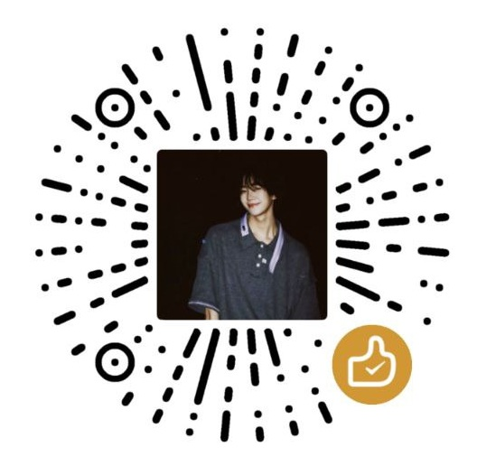

<h1 align="center">Hi 👋, I'm jiangchenyu199</h1>

  
  

<h2 align="left">👨‍💻 About Me - Full Stack Developer</h2>

  - 🌱 正在学习更多关于云原生和人工智能的知识 
  - 👯 寻找志同道合的开发者一起合作 
  - 💬 欢迎提问或讨论技术问题 

<h2 align="left">🎯 Goals</h2>
<ul align="left">
  <li>📚 今年学习3-5门新技术</li>
  <li>💻 贡献更多开源项目</li>
  <li>🌐 参与技术社区活动</li>
</ul>

<h2 align="left">🔗 Connect with Me</h2>

  

<h2 align="left">❤️ Support Me</h2>

  如果我的项目对你有帮助，请考虑支持我！

  <!-- 微信赞赏码 -->
  

    
<strong>微信赞赏码</strong>

    

      

        
      

    

  

  
  <!-- USDT支付 -->
  

    
<strong>USDT支付</strong>

    

      

        
      

    

  

  您的支持将帮助我继续开发和维护开源项目，非常感谢！

<h2 align="left">🏆 GitHub Trophies</h2>

  

<h2 align="left">📊 Contribution Graph</h2>

  

<h2 align="left">⚡ Skills Rating</h2>

  

<h2 align="left">🌏 Languages and Tools</h2>

<h2 align="left">🎯 Coding Challenges</h2>

  

<h2>📊 Stats and Activities</h2>

  
  

